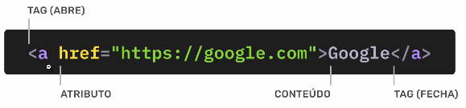

# HyperText Markup Language (HTML)

- Linguagem de marcação de texto.
- Marca o conteúdo e define a estrutura do site.

## Tag

- São etiquetas. Servem para marcar um conteúdo dentro do HTML.
- Servem para inserirmos conteúdos como textos, imagens e vídeos, por exemplo.
- Dão sentido ao conteúdo. A escrita de um documento semântico beneficia principalmente leitores de tela (acessibilidade) e leitores de código.
- Abrimos `<a>` e fechamos `</a>`
- Case insensitive, mas é uma boa prática escrever com letras minúsculas; exemplo: `<html>`.
- Permite a interação com `CSS` e `JavaScript`.

## Atributos

- Dão informações extras sobre uma taf para o browser.
- Eles ajudam o navegador a entender melhor como renderizar o elemento ou como ele deve se comportar.

